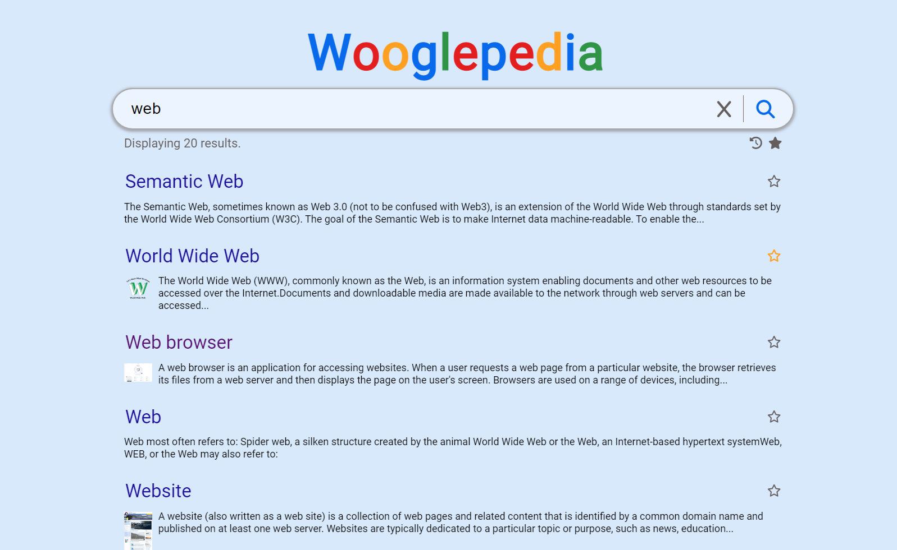
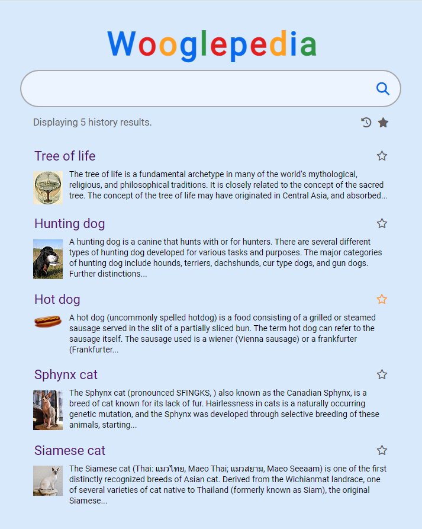
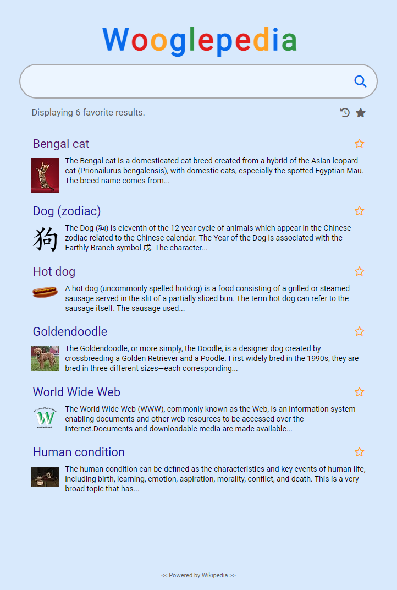

# Wooglepedia
Search Wikipedia articles.

## Introduction
This small project is a simple website that uses the Wikipedia API to search for articles.

## Technology stack
- Vanilla JavaScript (ES6+)
- HTML
- Sass

## Highlights
- DOM manipulation
- Event handling
- Accessibility support
- DRY (search- and result item handling)

## Future plans
I'm planning to extend the code I've written here with TypeScript.

## Illustration

